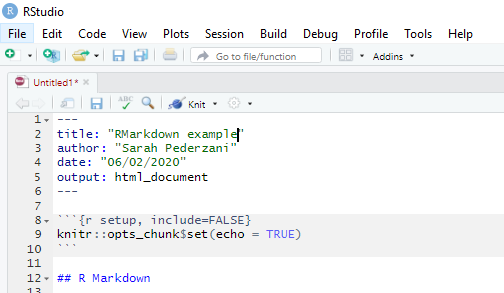

## General Information

something something

register by email here: 

## Requirements and Setup

### Software

You will need to bring your own laptop to the course with several pieces of software already installed. 

You will need:

**R** (at least version XXX)
---
**RStudio**
---
**R packages**: rmarkdown, knitr, tidyverse. These can be installed via the package management in RStudio or using the `install.packages()` command. After installing knitr, your RStudio gui should show a 'Knit' button at the top:
 

--- 
A **LaTeX** installation. This is very important. You will not be able to compile pdf documents if you don't have a working LaTeX engine. You have essentially two options

1) Install a minimal lightweight LaTeX distribution called TinyTex (https://yihui.org/tinytex/). TinyTex can be installed on Linux, Windows and Mac machines. It is specifically made for use with RMarkdown and is a good option if you only want to compile pdf documents and never look at the underlying LaTeX. This is easy to install but is not as well suited to advanced formatting of pdf documents as well as troubleshooting pdf compiling. So if you expect to write more complex documents like journal articles with pdf output you will fare better with a full LaTex installation. 

2) Install a full fledged LaTeX distribution and an editor. Choose this option if you expect to write more complex documents like journal articles with pdf output. I recommend installing TeXLive, which is available for Linux, Windows and Mac engines (https://www.tug.org/texlive/), but alternatives like MiKTeX (or any other LaTeX distribution) will work. You will also need to install an editor, for which I recommend TeXstudio (https://www.texstudio.org/). 

### Data sets

data sets

course github

## Schedule

09:00 | Introduction to RMarkdown, part 1 |
10:30 | Coffee break |
10:45 | Introduction to RMarkdown, part 2 |
12:15 | Lunch break |
13:00 | Writing Articles and Reports, part 1 |
14:30 | Coffee break |
14:45 | Writing Article and Reports, part 2 |
16:15 | Wrap up |

## Syllabus

### Introduction to RMarkdown

* Intro to RMarkdown and the RMarkdown workflow ([Reference](intro_1.md))
* RMarkdown document structure and setting up documents
* Code chunks, chunk options
* Figures and tables
* Export formats
* Basic formatting using latex and docx functionality

### Writing Articles and Reports

* parameterized reports
* intro to writing journal articles in RMarkdown
* using layout templates
* citations and bibliographies
* captions and cross references
* advanced formatting
* collaborating with co-authors

