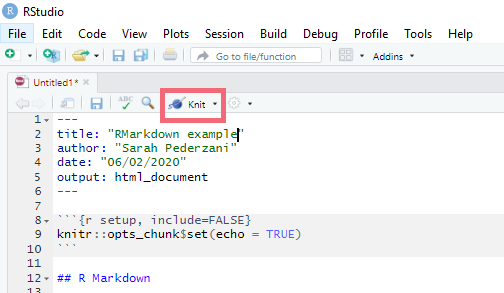

# RMarkdown course - 21st April 2020 - MPI EVA 4th floor seminar room

Please register by emailing sarah_pederzani@eva.mpg.de (limited number of places, indicate if you would like to attend the full workshop or only one portion)

## What is RMarkdown?

RMarkdown is a file format for generating dynamic documents in R that integrate formatted text with chunks of R code and R code output such as graphs or tables. RMarkdown documents are a tidy and reproducible way to both save and execute R code and produce high quality reports or article documents in a variety of output formats such as pdf, docx or html. You can use RMarkdown to write entire reproducable journal articles, set up automated result reports or even make presentation slides, posters or websites and github pages (like this one!). See the [RMarkdown website] https://rmarkdown.rstudio.com/lesson-1.html
for more information. 
## The course

This one day course is aimed at users who already have some familiarity with R and will provide a basic introduction to RMarkdown in the first part and will then focus on writing reproducible journal articles in RMarkdown in the afternoon portion. A more detailed schedule and syllabus is posted below. You can selectively attend only portions of the workshop (i.e. only the intro or only the more advanced parts), but please indicate if that will be the case when you register. 

This course will not give introductions to R itself, so all participants should have some knowledge of R that includes for example loading data, basic object types, subsetting and data transformations, basic tidyverse/dplyr syntax (i.e. the pipe operator `%>%`), making plots using ggplot. 

## Requirements and Setup

### Software

You will need to bring your own laptop to the course with several pieces of software already installed. 

You will need:

**R**: Version 3.6 or higher, an up to date installtion is recommended. You can use the installr package to update your R version without losing all your package installations. 

---
**RStudio**: You need at least version 1.2 or higher, an up to date RStudio is recommended. This means you will automatically have a working installation of Pandoc, which is needed for RMarkdown to work. 

---
**R packages**: rmarkdown, knitr, tidyverse, redoc. These can mostly be installed via the package management in RStudio or using the `install.packages()` command (except for redoc!). After installing knitr, your RStudio gui should show a 'Knit' button at the top:
 

Install the redoc package (detailed instructions at https://github.com/noamross/redoc) by using `remotes::install_github("noamross/redoc")` (requires that you previously installed the remotes package). 

--- 
A **LaTeX** installation. This is very important. You will not be able to compile pdf documents if you don't have a working LaTeX engine. You have two options:

1) Install a minimal lightweight LaTeX distribution called TinyTex (https://yihui.org/tinytex/). TinyTex can be installed on Linux, Windows and Mac machines. It is specifically made for use with RMarkdown and is a good option if you only want to compile pdf documents and never look at the underlying LaTeX. This is easy to install but is not as well suited to advanced formatting of pdf documents as well as troubleshooting pdf compiling. So if you expect to write more complex documents like journal articles with pdf output you will fare better with a full LaTex installation. 

2) Install a full fledged LaTeX distribution and an editor. Choose this option if you expect to write more complex documents like journal articles with pdf output. I recommend installing TeXLive, which is available for Linux, Windows and Mac engines (https://www.tug.org/texlive/), but alternatives like MiKTeX (or any other LaTeX distribution) will work. You will also need to install an editor, for which I recommend TeXstudio (https://www.texstudio.org/). 

### Data sets

To be announced. Please check back closer to the course date for data sets that will be used during the course. 

## Schedule

09:00 | Introduction to RMarkdown, part 1 |
10:30 | Coffee break |
10:45 | Introduction to RMarkdown, part 2 |
12:15 | Lunch break |
13:00 | Writing Articles and Reports, part 1 |
14:30 | Coffee break |
14:45 | Writing Article and Reports, part 2 |
16:30 | Wrap up |

## Syllabus

### Introduction to RMarkdown

* Intro to RMarkdown and the RMarkdown workflow
* RMarkdown document structure and setting up documents
* Code chunks, chunk options, inline code
* Figures and tables
* Export formats
* Basic formatting using latex and docx functionality

### Writing Articles and Reports

* parameterized reports
* workflows for writing journal articles in RMarkdown
* using layout templates
* captions and cross references
* citations and bibliographies
* advanced formatting
* using tracked changes with the redoc package

